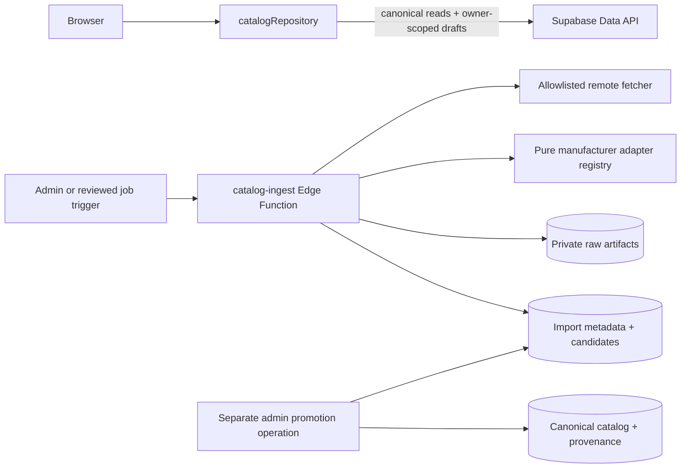

# Phase B B1.7 remote adapter and server-ingestion design

Status: **approved for design implementation** (2026-07-12)

This document defines the remote-fetch, adapter execution, staging, and reviewed-promotion
boundaries that follow B1.6. It is a design checkpoint only: it adds no migration SQL, Edge
Function code, service-role credentials, or canonical catalog writes.

## Scope and non-goals

The design covers:

- fetching configured manufacturer sources through a server-only boundary;
- running the pure B1.6 manufacturer adapters over fetched payloads;
- preserving immutable raw and normalized evidence;
- idempotent import-batch creation and candidate deduplication; and
- a separately authorized, transactional promotion path for reviewed candidates.

It does not yet implement a crawler, scheduler, admin UI, review RPC, candidate table, storage
bucket, or canonical promotion. User-provided URL hints remain a submission/evidence workflow,
not an arbitrary fetch capability.

## Architectural boundary



The browser never receives a service-role key, never loads the adapter registry, and never
fetches manufacturer pages on behalf of the ingestion service. `catalogRepository` keeps its
B1.6 capabilities unchanged: canonical reads and owner-scoped configuration/submission writes
are available; import-batch, canonical, and review writes remain absent.

The initial server boundary is a Supabase Edge Function invoked manually by an authenticated
admin or a trusted internal job trigger. A queue or scheduled crawler can be added later without
changing the adapter or candidate contracts.

## Contracts

### Adapter identity

Adapters remain framework-free and network-free. The server composes their output; it does not
make adapters import Supabase or write tables.

The applied schema permits only lowercase slug keys (`^[a-z0-9]+(?:-[a-z0-9]+)*$`) in
`manufacturers.adapter_key`. B1.6 tests currently use `mvp.catalog`, so the implementation
checkpoint must standardize on a slug such as `mvp-catalog` and keep any dotted/display name
outside the persisted key. No migration is needed for this correction because no adapter key
from B1.6 has been persisted by the client.

### Ingestion job request

The server entry point accepts a bounded request with:

```json
{
  "jobId": "client-or-internal-id",
  "adapterKey": "mvp-catalog",
  "adapterVersion": "1.0.0",
  "source": {
    "type": "manufacturer",
    "name": "MVP",
    "url": "https://manufacturer.example/catalog"
  },
  "mode": "stage"
}
```

`adapterKey`, `adapterVersion`, source type, and host are resolved against a server-side
allowlist. The caller cannot supply a service-role credential, a canonical row id, or a raw SQL
operation. `jobId` is an idempotency/correlation key and is not treated as a database identity.

### Fetch result

The fetcher returns a server-owned envelope containing requested URL, final URL, status,
content type, response byte count, ETag/Last-Modified values, capture time, and the SHA-256 of
the exact response bytes. The adapter receives the parsed payload plus the server-computed
checksum through the existing `sourceChecksum` parameter. The checksum therefore represents
the fetched artifact, not an object whose key order may have changed during parsing.

Raw bytes are immutable and stored privately. Logs contain the checksum and batch/job ids, never
the raw body or credentials.

### Candidate staging

The existing `catalog_entity_sources` table is reserved for promoted canonical rows because its
exactly-one-target check requires a canonical foreign key. Staged candidates therefore need a
future append-only migration for a queryable `catalog_import_candidates` table with, at minimum:

- `import_batch_id`, `row_number`, and a stable candidate id;
- `entity_type`, `identity_key`, and identity JSON;
- normalized fields JSON and the exact `supported_fields` list;
- source reference, evidence snapshot, confidence, and candidate checksum;
- validation/dedup/review status plus a machine-readable conflict code; and
- created/updated timestamps.

Raw response metadata and object paths may be added to the batch through additive columns or a
companion `catalog_import_artifacts` table. The choice is a migration-review decision; neither
is created in this checkpoint.

## Fetch security and politeness

The server fetcher must enforce all of the following before network I/O:

- HTTPS only; reject credentials, non-default ports, IP literals, localhost, loopback, link-local,
  multicast, and private/reserved address ranges;
- per-adapter host allowlists, with redirect targets revalidated and a small redirect limit;
- response timeout, maximum body size, allowed content types, and a bounded decompression ratio;
- no script execution, browser rendering, form submission, or image copying;
- one-at-a-time host requests with a minimum delay and `Retry-After` handling; and
- explicit user-agent and source attribution headers.

User-supplied URLs are never fetched directly by an ordinary authenticated user. A URL hint is
stored as submission evidence and enters the reviewed source configuration path.

## Idempotency, status, and deduplication

`catalog_import_batches` remains the durable batch identity. The existing unique key
`(source_id, adapter_name, adapter_version, source_checksum)` makes a repeated fetch of the same
artifact a read/replay operation. The server resolves `catalog_sources` by its unique source
identity; it does not trust an id supplied inside an adapter payload.

The current batch statuses retain their meaning:

```text
staged -> reviewed -> accepted
      \-> rejected
      \-> failed
```

`staged` means the raw artifact and normalized candidates are durable. `reviewed` means every
candidate has an explicit review disposition. `accepted` means the reviewed promotion completed
atomically. A per-candidate status is required for partial review without making the batch itself
look accepted.

Deduplication has three layers:

1. The adapter rejects duplicate `identityKey` values within one envelope.
2. The staging writer compares identity and candidate checksums with prior staged batches and
   marks unchanged, changed, new, or conflicting candidates.
3. Promotion resolves entity-specific canonical identities and never overwrites a conflicting
   canonical row without an explicit review decision.

Network retries are bounded and classified. A retry never creates a second batch or a second raw
artifact for the same source/adapter/version/checksum tuple.

## Reviewed promotion boundary

Promotion is a separate admin-only operation, not a mode of `catalog-ingest`. It reads only
explicitly approved candidates and runs in one transaction. Dependency order is:

```text
manufacturer -> alias
manufacturer -> mold / plastic
mold + plastic -> mold_plastic
mold_plastic -> run -> stamp
```

The writer uses entity-specific allowlists and natural identity lookups. It does not construct
dynamic SQL from adapter field names, accept client-provided canonical ids, or copy manufacturer
images. Every promoted row receives a `catalog_entity_sources` record containing the source,
batch, source reference, supported fields, evidence snapshot, confidence, and capture time.

Any dependency or uniqueness conflict aborts the transaction and leaves the batch/candidates
available for correction. There is no partial canonical promotion.

## Authorization and data handling

- `service_role` is available only inside the server function or trusted promotion worker.
- Import batches, candidate rows, and raw artifacts have no ordinary-client read/write path.
- Canonical tables remain authenticated-read/service-write as established by B1.5.
- Admin authorization must be explicit (reviewed claim/allowlist for user invocation, or a signed
  internal trigger); a valid authenticated session alone is insufficient.
- Error summaries are redacted and bounded. Raw payloads, tokens, cookies, and response headers
  containing secrets are never logged.
- Private artifacts have a retention policy and immutable paths keyed by checksum.

## Verification gates

Before any production ingestion or canonical promotion:

1. Unit-test URL policy, redirect revalidation, byte limits, timeout classification, checksum
   handling, adapter-key validation, and candidate field allowlists.
2. Integration-test the Edge Function with mocked fetch/storage for duplicate jobs, 304 responses,
   changed checksums, adapter failures, malformed payloads, and retry behavior.
3. Add negative RLS/grant tests proving anon and ordinary authenticated clients cannot write/read
   import batches, candidates, or private artifacts.
4. Test promotion conflicts, composite-FK violations, duplicate identities, and full transaction
   rollback with zero partial canonical rows or provenance rows.
5. Re-run the existing B1.6 repository/adaptor suite and browser smoke tests unchanged.
6. Run the migration backup, apply, advisor, RLS, and rollback gates before adding the candidate
   table or promotion RPCs.

## Implementation sequence after this design checkpoint

1. Amend the adapter contract tests to use the persisted slug key and add the server envelope and
   fetch-policy pure contracts.
2. Implement a mocked, server-only staging function with no canonical write path.
3. Review and add the append-only candidate/artifact schema, with a fresh verified backup.
4. Add the admin-only promotion operation and its atomic/RLS tests.
5. Run one bounded manufacturer fixture in a non-production environment; promote only after an
   explicit review record.

No step above authorizes automatic canonical writes from remote ingestion.
